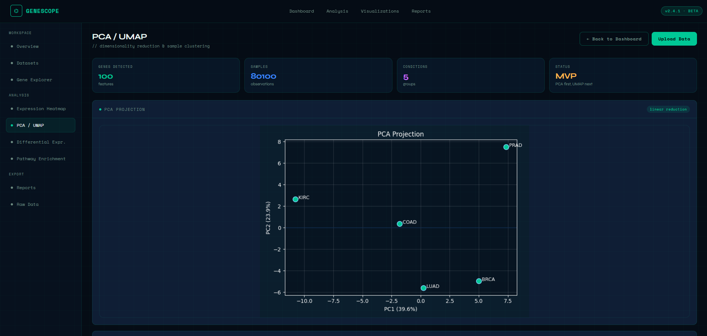
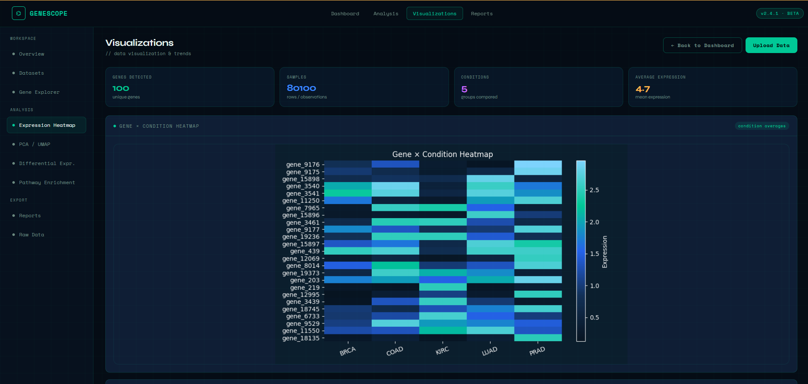
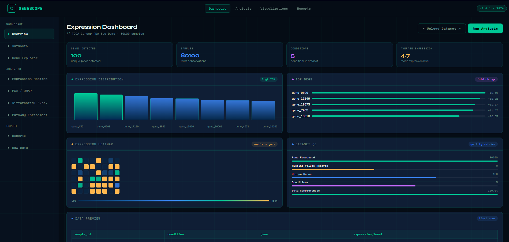

<h1>GeneScope</h1>

  GeneScope is a bioinformatics web application for exploring gene expression datasets through visual analysis,
  quality control summaries, dimensionality reduction, differential expression previews, and pathway enrichment workflows.

  Built with Flask and Python, GeneScope combines software engineering, data visualization, and genomics-focused analysis
  into an interactive multi-page platform.

<h2>Overview</h2>

  GeneScope allows users to upload gene expression datasets and automatically generate dataset quality summaries,
  expression visualizations, heatmaps, PCA/UMAP projections, differential expression previews, pathway enrichment analysis,
  and exportable reports.

<h2>Screenshots</h2>

<h3>PCA / UMAP Analysis</h3>

<h3>Gene × Condition Heatmap</h3>

<h3>Expression Dashboard</h3>

<h2>Features</h2>

<ul>
  <li>CSV gene expression upload</li>
  <li>Automatic gene, expression, and condition column detection</li>
  <li>Support for long-format and wide-format expression datasets</li>
  <li>Dataset quality control metrics</li>
  <li>Expression distribution visualizations</li>
  <li>Gene × condition heatmap generation</li>
  <li>PCA dimensionality reduction</li>
  <li>UMAP dimensionality reduction</li>
  <li>Differential expression preview</li>
  <li>Pathway enrichment framework</li>
  <li>Raw data preview</li>
  <li>Downloadable plain-text analysis report</li>
  <li>Multi-page Flask dashboard interface</li>
</ul>

<h2>Tech Stack</h2>

<ul>
  <li>Python</li>
  <li>Flask</li>
  <li>Pandas</li>
  <li>NumPy</li>
  <li>Matplotlib</li>
  <li>scikit-learn</li>
  <li>UMAP-learn</li>
  <li>GSEApy</li>
  <li>HTML</li>
  <li>CSS</li>
</ul>

<h2>Example CSV Format</h2>

<h3>Long Format</h3>

<pre><code>gene,expression,condition
BRCA1,50,Cancer_A
BRCA1,45,Cancer_B
EGFR,35,Cancer_A
EGFR,10,Healthy_A
TP53,2,Cancer_A
TP53,25,Healthy_A</code></pre>

<h3>Wide Format</h3>

<pre><code>sample_id,condition,BRCA1,EGFR,TP53
sample_1,Cancer,50,35,2
sample_2,Healthy,5,10,25
sample_3,Cancer,45,32,3</code></pre>

<h2>Project Workflow</h2>

<pre><code>Upload dataset
→ Detect columns
→ Clean and preprocess expression data
→ Calculate quality metrics
→ Generate expression summaries
→ Create gene × condition heatmap
→ Run PCA and UMAP
→ Rank top expression differences
→ Run pathway enrichment when enough valid genes are available
→ Export analysis report</code></pre>

<h2>Dataset Testing</h2>

  GeneScope was tested using both small mock expression datasets and a larger TCGA-style RNA-seq dataset containing
  cancer expression profiles across multiple cancer classes. For performance and readability, the large dataset workflow
  selects the top variable genes before generating heatmaps and dimensionality reduction plots.

<h2>Pathway Enrichment Note</h2>

  Pathway enrichment requires a sufficiently large list of biologically meaningful gene symbols. Small mock datasets or
  anonymized gene IDs may not generate enriched pathways. This reflects the statistical nature of enrichment analysis and
  the need for recognizable gene identifiers such as official human gene symbols.

<h2>Current Limitations</h2>

<ul>
  <li>Differential expression is currently based on expression difference ranking, not full statistical testing.</li>
  <li>Pathway enrichment depends on valid gene identifiers and larger gene lists.</li>
  <li>Plots are currently static Matplotlib images.</li>
  <li>Large datasets are reduced using top variable gene filtering for performance.</li>
</ul>

<h2>Future Improvements</h2>

<ul>
  <li>Add real GEO accession import support</li>
  <li>Add interactive Plotly visualizations</li>
  <li>Improve statistical differential expression analysis</li>
  <li>Add adjusted p-values and volcano plots</li>
  <li>Add downloadable PDF reports</li>
  <li>Add gene search and filtering controls</li>
  <li>Improve mobile responsiveness</li>
  <li>Deploy a public demo version</li>
</ul>

<h2>Author</h2>

  <strong>Sophia Sipayboun</strong> 
  Computer Science graduate, focused on software development, data analytics, and bioinformatics.

